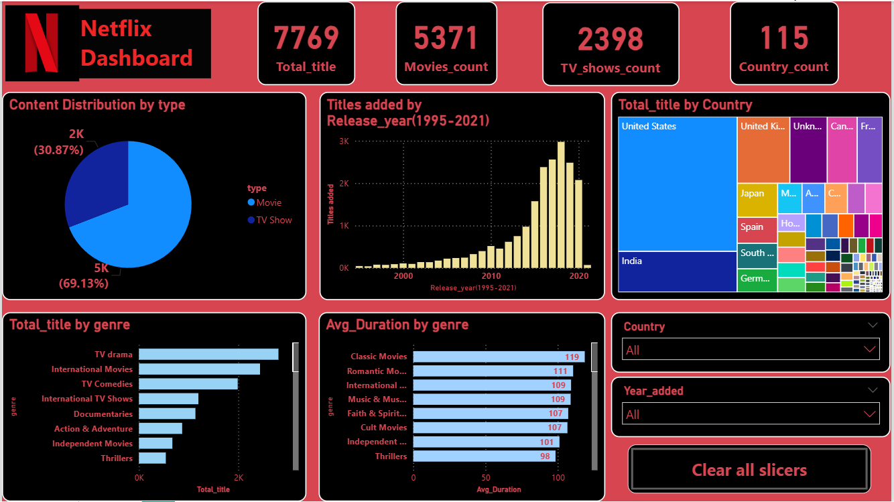

# 🎬 Netflix Analytics Dashboard — Power BI


---

## 📌 Project Overview

This project is an **interactive Netflix Content Analytics Dashboard** built in Microsoft Power BI, analyzing Netflix's global content library of **7,769 titles** across movies, TV shows, genres, countries, release years, and average durations.

The central business question this dashboard answers:

> **"How has Netflix built its content library — which countries, genres, and content types dominate, what are average runtimes by genre, and how has the catalog evolved over time?"**

Just as a web developer deploys a live website anyone can open and interact with, this dashboard is a **published, filterable report** that media analysts, content strategists, or recruiters can explore in real time.

> 📸 **Dashboard Preview:**



---

## 🗂️ Repository Structure

```
netflix-analytics-dashboard-powerbi/
│
├── 📁 data/
│   └── NetFlix.csv                    # Raw dataset — 7,769 Netflix titles
│
├── 📁 report/
│   └── Net1.pbix                      # Power BI Desktop report file
│
├── 📁 screenshots/
│   └── dashboard_preview.png          # Full dashboard screenshot
│
└── README.md                          # You are here
```

---

## 📊 Dataset Description

**Source:** Netflix Titles Dataset (publicly available)  
**File:** `NetFlix.csv`  
**Total Records:** 7,769 titles  
**Format:** CSV (flat file, single table)

### Columns

| Column | Description |
|---|---|
| `show_id` | Unique identifier for each title |
| `type` | Content type — Movie or TV Show |
| `title` | Name of the title |
| `director` | Director name(s) |
| `cast` | Main cast members |
| `country` | Country where content was produced |
| `date_added` | Date the title was added to Netflix |
| `release_year` | Original year of release |
| `rating` | Content rating (TV-MA, TV-14, R, PG-13, etc.) |
| `duration` | Length in minutes (Movies) or seasons (TV Shows) |
| `genres` | Genre tags (comma-separated, multi-genre) |
| `description` | Short plot summary |

---

## 📈 Dashboard Features & Visuals

| Visual | Type | What It Shows |
|---|---|---|
| **Total Titles** | KPI Card | 7,769 total content pieces on Netflix |
| **Movies Count** | KPI Card | 5,371 movies in the library |
| **TV Shows Count** | KPI Card | 2,398 TV shows in the library |
| **Country Count** | KPI Card | Content spanning 115 unique countries |
| **Content Distribution by Type** | Pie Chart | Movie vs TV Show split — 69.13% Movies, 30.87% TV Shows |
| **Titles Added by Release Year (1995–2021)** | Bar Chart | Year-on-year catalog growth showing Netflix's content expansion |
| **Total Title by Country** | Treemap | Which countries produce the most Netflix content |
| **Total Title by Genre** | Horizontal Bar Chart | Top genres by total title count |
| **Avg Duration by Genre** | Horizontal Bar Chart | Average runtime (minutes) per genre — e.g. Classic Movies at 119 min |
| **Country Slicer** | Dropdown | Filter entire dashboard by production country |
| **Year Added Slicer** | Dropdown | Filter by the year a title was added to Netflix |
| **Clear All Slicers** | Button | Reset all active filters in one click |

---

## 🔍 Problem Solved & Data Story

### ❓ The Business Problem

Netflix's raw content catalog is a flat CSV with 7,769 rows and 12 columns. In that form, it answers nothing. A content strategist asking *"Which genres should we invest in?"*, *"Which genres have the longest runtimes?"*, or *"How has our library grown year over year?"* would need to manually filter, pivot, and chart the data in Excel — a slow, error-prone process.

This dashboard turns that raw file into an **interactive, always-on analytics tool** where every dropdown filter updates every visual simultaneously.

### ✅ What Was Built

A single-page Power BI dashboard with 7 visuals, 2 slicers, and a clear-all button — covering content type, genre, country, release year, and average duration by genre — giving content and business teams a complete view of Netflix's library in one screen.

### 📢 Key Findings from the Data

| # | Finding | Stat |
|---|---|---|
| 1 | **Movies dominate the library** | 5,371 Movies (69.13%) vs 2,398 TV Shows (30.87%) |
| 2 | **USA produces the most content by far** | Largest block in the country treemap — nearly 3× any other country |
| 3 | **India is Netflix's #2 content country** | Second largest producer after the United States |
| 4 | **TV Drama is the #1 genre** | Tops the genre bar chart by total title count |
| 5 | **International Movies ranks #2 by genre count** | Reflects Netflix's global-first content investment strategy |
| 6 | **Classic Movies have the longest average runtime** | 119 minutes average — longest of any genre |
| 7 | **Romantic Movies average 111 minutes** | Second longest average runtime by genre |
| 8 | **Thrillers average just 98 minutes** | Shortest average runtime among the top genres shown |
| 9 | **Content additions surged from 2015 onward** | Bar chart shows near-zero additions pre-2010, explosive growth 2015–2019 |
| 10 | **South Korea, Spain, and Germany appear prominently** | All visible in the country treemap — Netflix's international investment is clear |

### 💼 Business Insights & Recommendations

1. **TV Drama's dominance signals audience preference** — with the highest title count of any genre, drama content clearly drives Netflix's catalog strategy across both movies and TV shows.

2. **Classic and Romantic Movies are long-form commitments** — averaging 119 and 111 minutes respectively, these genres require viewers to invest more time. This supports premium or weekend-viewing positioning.

3. **International content is deeply embedded** — International Movies ranking as the #2 genre by count confirms that funding local-language content globally is a structural part of the catalog, not just a marketing angle.

4. **The 2019 content peak tells a story** — the release year bar chart shows peak catalog additions around 2019, representing Netflix's heaviest investment period before the subscriber growth slowdown of 2021–22.

5. **India is a priority market** — appearing as the second-largest country in the treemap validates Netflix's aggressive India originals strategy.

---

## 🛠️ Tools & Technologies

| Tool | Purpose |
|---|---|
| **Microsoft Power BI Desktop** | Dashboard design, data modelling, all visuals |
| **Power Query (M Language)** | Data type corrections, date column parsing, genre splitting |
| **DAX (Data Analysis Expressions)** | Custom KPI measures and calculated columns |
| **CSV (Flat File)** | Single-table source data |

---

## 📐 DAX Measures Used

```dax
-- Total Titles
Total Titles = DISTINCTCOUNT('NetFlix'[show_id])

-- Movies Count
Movies Count = CALCULATE(DISTINCTCOUNT('NetFlix'[show_id]),
                'NetFlix'[type] = "Movie")

-- TV Shows Count
TV Shows Count = CALCULATE(DISTINCTCOUNT('NetFlix'[show_id]),
                  'NetFlix'[type] = "TV Show")

-- Country Count
Country Count = DISTINCTCOUNT('NetFlix'[country])

-- Average Movie Duration by Genre
Avg Duration = AVERAGE('NetFlix'[duration])
```

---

## ❓ Common Interview Questions About This Project

**Q: What problem does this dashboard solve?**  
A: It transforms a flat 7,769-row CSV into an interactive catalog analytics tool — letting content strategists answer questions about genre distribution, country production, average runtimes, and catalog growth trends in seconds instead of hours.

**Q: What was your most interesting finding?**  
A: The average duration chart reveals a clear pattern — Classic Movies average 119 minutes while Thrillers average just 98 minutes. This suggests that older, nostalgic content skews longer while modern genre films are getting shorter — a reflection of changing viewer attention spans.

**Q: What does the Avg Duration by Genre chart add over the Total Title chart?**  
A: Volume alone doesn't tell the full story. A genre can have fewer titles but require much more viewer time per title. The duration chart adds a quality-of-investment layer — International Movies, for example, rank #2 in count *and* average 109 minutes, making them a high-volume AND high-commitment category.

**Q: Why Power BI over a simple Excel chart?**  
A: All 7 visuals are connected through one data model. A single country dropdown filter updates every chart at once — the genre mix, duration averages, release year trend, and KPI cards all refresh simultaneously. You can't replicate that cross-filtering cleanly in Excel.

**Q: What would you add with more data?**  
A: Subscriber engagement data (watch hours, completion rate per genre) to correlate content investment with actual viewership — moving from descriptive analytics (what's in the catalog) to prescriptive analytics (what should be added next).

---

## 📄 License

The Netflix dataset used in this project is publicly available for educational and portfolio purposes.

---

> ⭐ If this project helped you or gave you ideas, consider giving it a star on GitHub!
